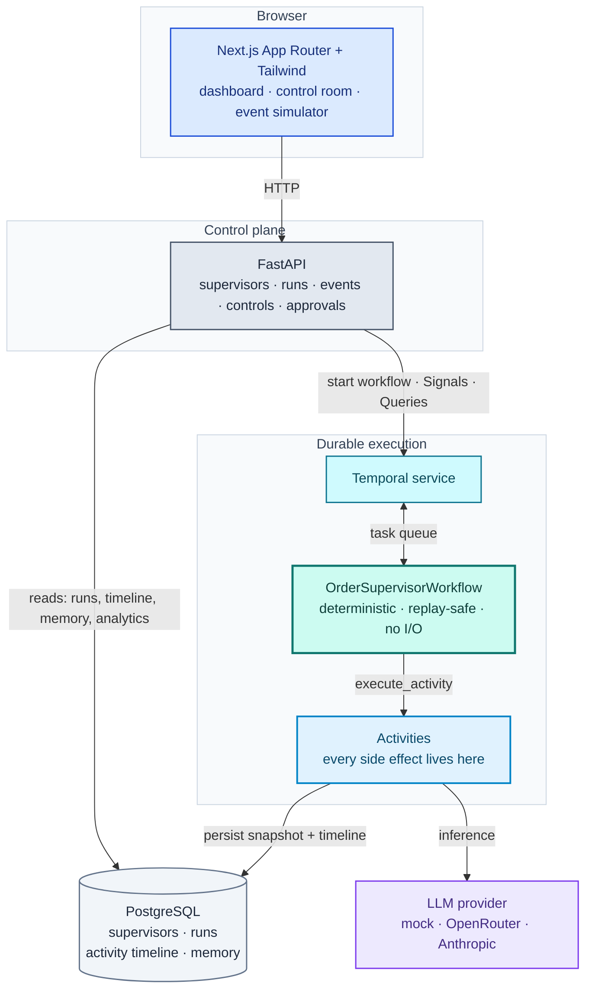
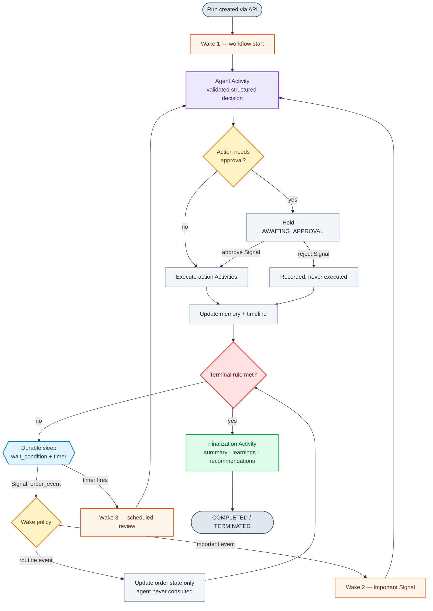

<div align="center">

# OrderPilot

### A durable, event-driven AI Order Supervisor

**One order → one long-running Temporal workflow → an AI that is woken only when it is actually needed.**

[](https://www.python.org/)
[](https://temporal.io/)
[](https://fastapi.tiangolo.com/)
[](https://nextjs.org/)
[](https://www.postgresql.org/)
[](#tests-and-verification)
[](#tests-and-verification)
[](#ai-provider)

</div>

---

A long-running AI supervisor for e-commerce orders. Each order gets **one durable workflow** that can live for days. Lifecycle events arrive as **Signals**. A cheap deterministic rule layer decides whether the AI is needed at all; when it is, the agent returns a **validated structured decision** and takes auditable business actions from an **allow-list**. Between events the workflow **sleeps on a durable timer** instead of polling. Only deterministic workflow rules can end a run — the model may *recommend* completion, but it cannot cause it.

> [!IMPORTANT]
> **The engineering story is not "a chatbot for orders."**
> It is a durable, event-driven supervisor whose lifecycle is owned by Temporal, with the AI as a component *inside* it rather than the thing in charge. Every design decision below follows from that.

<table>
<tr>
<td width="25%" valign="top">

**Durable**

Survives worker restarts. Sleeps for days on a Temporal timer. Zero polling loops.

</td>
<td width="25%" valign="top">

**Frugal**

Routine events never reach the model. The wake rate is measured and shown.

</td>
<td width="25%" valign="top">

**Governed**

Allow-list enforced three times. Sensitive actions held for a human.

</td>
<td width="25%" valign="top">

**Auditable**

Append-only timeline explains every wake, decision, and action.

</td>
</tr>
</table>

---

## Contents

| Section | What it answers |
| --- | --- |
| [Architecture](#architecture) | How the pieces fit, with diagrams |
| [System design](#system-design) | Who owns what, and why those boundaries |
| [Temporal usage](#temporal-usage) | Signals, Queries, timers, durability, Continue-As-New |
| [Agent orchestration](#agent-orchestration) | Wake policy, decision contract, actions, approval, memory |
| [The product](#the-product-end-to-end) | Quick start and the walkthrough |
| [API](#api) | Every endpoint |
| [Tests](#tests-and-verification) | What is actually guaranteed |
| [Tradeoffs](#known-tradeoffs) | What was deliberately left out |

---

## Architecture



> [!NOTE]
> **The one rule that shapes everything:** workflow code performs **no I/O**. Inference, action execution, memory compaction, database writes, and final-summary generation are all Activities with explicit timeouts and retry policies. That is what keeps replay deterministic while the work itself is not.

### The supervision loop



---

## System design

### Who owns what

| Layer | Owns | Explicitly does **not** own |
| :--- | :--- | :--- |
| **Temporal workflow** | Order lifecycle, pending events, pause state, next wake, terminal rules | Any I/O, any inference, any database write |
| **Activities** | LLM inference, action execution, memory compaction, DB writes, finalization | Lifecycle decisions |
| **FastAPI** | Supervisor CRUD, run creation, event and instruction injection, controls, reads | Run progress — it never writes it |
| **PostgreSQL** | Product record: supervisors, runs, append-only timeline, memory, final outputs | Execution state |
| **Next.js** | Presentation and operator intent | Business logic of any kind |

Two boundaries are worth calling out, because they are the ones that usually go wrong.

<table>
<tr><td>

**① The API never writes run progress**

It starts workflows and sends Signals; the workflow persists its own state through an Activity. **One writer per run**, so the API and the workflow can never race to describe the same thing.

</td><td>

**② Temporal and Postgres both hold state — deliberately**

Temporal is the *execution* truth, Postgres the *product* truth. Reading a finished run's timeline out of Temporal would couple the product to an engine's retention policy. So a persistence failure is **non-fatal**: the run keeps supervising and retries later, because a reporting outage must not stop supervision.

</td></tr>
</table>

### Code layout mirrors those boundaries

```text
backend/app/domain/      pure deterministic logic — no I/O, no clock, no randomness
backend/app/agent/       decision contract, prompts, providers, action execution
backend/app/temporal/    workflow, activities, worker, client, I/O contracts
backend/app/services/    product operations mapped onto Temporal operations
backend/app/api/         routers, schemas, dependencies — thin by design
frontend/                dashboard · supervisors · start run · control room
```

`app/domain/` is pure on purpose: safe inside the workflow sandbox **and** testable without a Temporal server — which is why most wake-policy and lifecycle tests need no infrastructure at all.

### Data model

<details>
<summary><b>Three tables, append-only where it matters</b> — click to expand</summary>

<br>

| Table | Holds |
| --- | --- |
| `supervisors` | Reusable policy: instruction, allowed actions, wake sensitivity, review interval, approval policy, Continue-As-New threshold |
| `runs` | One per order: status, structured order state, memory, instructions, latest decision, wake guidance, counters, next/last wake, final output |
| `activities` | The unified timeline. Append-only, ordered by a per-run sequence with a unique `(run_id, seq)` constraint, so a retried write **cannot** duplicate history |

Order state is modelled **explicitly**, never inferred from prose:

```json
{
  "payment":     { "status": "confirmed" },
  "fulfillment": { "status": "ready_to_pick" },
  "shipment":    { "status": "delayed", "delay_reason": "storm" },
  "delivery":    { "status": "pending" },
  "refund":      { "status": "none" },
  "customer":    { "last_message": "Where is my order?" }
}
```

</details>

---

## Temporal usage

### One workflow per order

Started with the ID `order-supervisor:<order_id>`, so **Temporal's own ID uniqueness** guarantees exactly one supervisor per order. A duplicate start is rejected by the API with `409` before it reaches Temporal.

### Signals — everything asynchronous

| Signal | Effect |
| :--- | :--- |
| `order_event` | Validated in the handler, de-duplicated by `event_id`, queued |
| `add_instruction` | Live guidance that affects every subsequent decision |
| `pause` / `resume` | Suspends and restores event processing |
| `approve_action` / `reject_action` | Settles a held sensitive action |
| `terminate` | Ends the run — works while sleeping **and** while paused |

Malformed or duplicate Signals are recorded on the timeline rather than corrupting state.

### Queries — reading live state

| Query | Returns |
| :--- | :--- |
| `state` | Status, order state, memory, instructions, latest decision, wake decision, approvals, guidance, next wake, counters |
| `timeline` | Recent unified activity entries |

`GET /api/runs/{id}/state` prefers the live Query and falls back to the persisted snapshot when the workflow has closed — **labelling which source answered**.

### Durable timers, not polling

```python
# Wakes on a Signal or on the timer — and on nothing else.
await workflow.wait_condition(
    self._needs_attention,
    timeout=self._seconds_until_next_wake(),   # min(next review, max run age)
)
```

There is **no polling loop anywhere** in the system. A paused run stops processing events but stays terminable; a terminal run clears its next wake so it can never schedule another.

### Three ways the agent wakes

| Trigger | What it is for |
| :--- | :--- |
| **Workflow start** | Establish a baseline and schedule the first review |
| **An important Signal** | Decided by the wake policy, not merely by the event arriving |
| **The durable timer** | A scheduled review with no external trigger |

### Durability — the worker is disposable

> [!TIP]
> **Demonstrate this live.** It is the most convincing 60 seconds in the whole project.

1. Start a run and let it reach a sleeping state.
2. **Stop the worker.** The API and UI keep serving; the countdown keeps running.
3. **Inject an event.** It is accepted — Temporal holds the Signal durably.
4. **Restart the worker.** The run picks it up, wakes, decides, and continues with memory and timeline intact.

`tests/test_p1.py::test_run_survives_a_worker_restart_while_sleeping` automates exactly this against a real dev server, including a window where **no worker exists at all**.

### Continue-As-New

A supervisor can continue after *N* events (`continue_as_new_after_events`; `0` disables, `2`–`5` makes it easy to watch). The continuation carries **only compact state** — order state, memory, instructions, guidance, counters, executed actions, pending approvals, queued events, and a bounded tail of seen event ids — because the full timeline already lives in Postgres. Order ID, run ID, and workflow ID are all preserved, so it remains **one logical run**.

It only happens at a quiet point: never mid-event, never while an approval is pending, never while paused, never on a terminal run. Events arriving *during* the continuation are carried across rather than dropped — a subtlety with its own regression test, because losing a Signal there would be **silent**.

---

## Agent orchestration

### Wake policy — cheap first, AI only when needed

```mermaid
flowchart LR
    E["Event arrives"] --> A{"Known lifecycle<br/>event type?"}
    A -->|"yes"| T["Level A<br/>deterministic table<br/>free · instant"]
    A -->|"unknown type or<br/>free-text customer message"| B["Level B<br/>lightweight classifier"]
    B -->|"provider fails"| FB["Deterministic fallback"]
    T --> CAP{"Meets the supervisor's<br/>wake sensitivity?"}
    B --> CAP
    FB --> CAP
    CAP -->|"no"| NOWAKE["State updated<br/>agent not consulted"]
    CAP -->|"yes"| WAKE["Wake the agent"]
    NOWAKE --> REC["WAKE_DECISION recorded<br/>with the rule that decided"]
    WAKE --> REC

    classDef entry fill:#e2e8f0,stroke:#475569,color:#1e293b,stroke-width:1.5px
    classDef branch fill:#fef3c7,stroke:#d97706,color:#713f12,stroke-width:2px
    classDef levelA fill:#dcfce7,stroke:#16a34a,color:#14532d,stroke-width:2px
    classDef levelB fill:#ede9fe,stroke:#7c3aed,color:#432c83,stroke-width:2px
    classDef fallback fill:#f1f5f9,stroke:#94a3b8,color:#1e293b,stroke-width:1.5px
    classDef quiet fill:#f1f5f9,stroke:#94a3b8,color:#334155,stroke-width:1.5px
    classDef loud fill:#fff7ed,stroke:#ea580c,color:#7c2d12,stroke-width:2px

    class E entry
    class A,CAP branch
    class T levelA
    class B levelB
    class FB fallback
    class NOWAKE quiet
    class WAKE loud
    class REC entry
```



**Level A** is a deterministic table over events whose meaning is fixed by the domain — `payment_failed`, `refund_requested`, `order_cancelled` are critical; `shipment_delayed`, `delivered`, `refund_completed` are high; `order_created`, `payment_confirmed`, `shipment_created` are low and normally update state without waking the agent. This path is free and runs first.

**Level B** runs **only** where a table cannot honestly answer: an unrecognised event type, or a customer message whose meaning lives in the text. It returns a validated `{wake_now, severity, category, reason}`.

Three properties make this safe rather than merely clever:

| Property | Why it matters |
| :--- | :--- |
| **The classifier never has the last word** | Its severity is capped by the supervisor's configured sensitivity — a `LOW` verdict cannot wake a `BALANCED` supervisor even if the model asks |
| **Failure degrades to rules** | Triage never depends on the model being up |
| **Unknown events escalate** | They are never silently dropped |

Every verdict is recorded with the rule that produced it — `deterministic_severity_table`, `ai_classifier:<provider>`, or `classifier_fallback_deterministic` — so the UI can always explain why the agent was or was not consulted.

### The decision contract

Model output is a **Pydantic model**, validated before it can affect anything:

```jsonc
{
  "decision": "ACT | SLEEP | NO_ACTION",
  "priority": "LOW | MEDIUM | HIGH | CRITICAL",
  "reason_summary": "short auditable explanation",       // stored; never chain-of-thought
  "actions": [{ "tool": "message_logistics_team", "arguments": { "message": "..." } }],
  "memory_update": "compact factual update",
  "sleep": { "mode": "duration", "minutes": 30 },
  "wake_guidance": ["treat any further delay as critical"],
  "completion_recommended": false                        // advisory only — see below
}
```

Tool names are a **closed enum in the schema**, so an invented tool fails validation before it ever reaches the allow-list. Malformed output is retried once, then replaced by a deterministic fallback that takes no action and schedules an ordinary review — **a provider outage degrades to a quiet supervisor, never a wrong one.**

### Actions and the allow-list

The five assignment actions — `message_fulfillment_team`, `message_payments_team`, `message_logistics_team`, `message_customer`, `create_internal_note` — are simulated, validate their input, return structured success/failure, and appear on the timeline.

> [!WARNING]
> **The allow-list is enforced three times:** in the schema, in the Activity against the supervisor's configuration, and again at execution. An `ACT` whose every tool was rejected is downgraded to `NO_ACTION`, so a decision can never claim an action it did not take.

### Human approval

A supervisor can require approval for sensitive actions; `message_customer` is the default. The agent proposes normally, the workflow **holds** the action, and the run reports `AWAITING_APPROVAL` with the exact message shown *unsent*. Approved actions execute from the run loop rather than inside the Signal handler, keeping execution on the deterministic path.

**There is no code path from a rejection to an execution.**

### Lifecycle authority stays with the workflow

A run ends only through workflow rules: a terminal event (`delivered`, `refund_completed`, `order_cancelled`), a `terminate` Signal, or the configured maximum age.

This is tested **adversarially**: a stub provider that recommends completion on *every* decision still cannot finish a run — only a later `delivered` event does.

### Memory and context

Memory is a compact rolling summary with a line cap and a marker for what was compacted away. Each decision's context is assembled from the supervisor instruction, live run instructions, structured order state, memory, the triggering event, the wake evaluation, a small recent-activity window, and the allowed actions. **Full history is never sent.**

### Adaptive wake guidance

The agent may emit up to three short standing hints, which are cleaned, de-duplicated, length-capped, persisted, and fed to later classifications. Advisory input to triage **only** — it cannot widen the allow-list or lower the wake threshold.

---

## The product, end to end

### Quick start

**Prerequisites:** Docker Desktop (Linux containers) · Python 3.11+ · [uv](https://docs.astral.sh/uv/getting-started/installation/) · Node.js 20+ · **no API key required**

```powershell
# 1 — Infrastructure: PostgreSQL + Temporal dev server
Copy-Item .env.example .env
docker compose up -d --wait

# 2 — Database schema
Set-Location backend
uv sync --locked
uv run --locked alembic upgrade head

# 3 — Worker            (terminal 1)
uv run --locked python -m app.temporal.worker

# 4 — API               (terminal 2)
Set-Location backend
uv run --locked uvicorn app.main:app --port 8000

# 5 — Frontend          (terminal 3)
Set-Location frontend
npm ci
npm run dev
```

Then open **<http://127.0.0.1:3000>**.

| Service | Address |
| :--- | :--- |
| Frontend | <http://127.0.0.1:3000> |
| API docs | <http://127.0.0.1:8000/docs> |
| Temporal UI | <http://127.0.0.1:8233> |
| PostgreSQL | `127.0.0.1:5432` |

> [!NOTE]
> **All three processes are required.** The API starts workflows, the worker executes them, the frontend drives the API. With the worker stopped, runs are created but never progress — which is also exactly how the durability demo works.

### AI provider

The product works **with no API key at all**. `LLM_PROVIDER` selects the backend for both the agent and the classifier:

| Value | Behaviour |
| :--- | :--- |
| `mock` | Deterministic, offline, free. The default, and the safest choice for a recorded demo. |
| `openrouter` | Real model via OpenRouter (OpenAI-compatible). Needs `OPENROUTER_API_KEY`; defaults to `anthropic/claude-sonnet-4.5`. |
| `claude` | Real model via the Anthropic API. Needs `ANTHROPIC_API_KEY`; defaults to `claude-opus-5`. |

Set the key in `.env`, which is gitignored. **The test suite forces the mock provider**, so tests never make a paid call regardless of local configuration. The mock is not merely a test double — it reuses the same deterministic policy the workflow was proven against, so the whole product can be demonstrated without a key.

### The screens

| Screen | What it shows |
| :--- | :--- |
| **Dashboard** | Every supervised order bucketed by what it is doing — acting, sleeping, needs attention, completed — with next wake, last wake, and counters |
| **Supervisors** | Three templates that differ in *behaviour*, plus full configuration: instruction, allowed actions, wake sensitivity, review interval, approval policy, Continue-As-New threshold |
| **Start run** | Order ID, order context, supervisor choice, and an optional instruction scoped to this run alone |
| **Run Control Room** | The main screen: status and countdown, structured order state, compact memory, the latest decision *and the wake decision behind it*, adaptive guidance, pending approvals, unified timeline, action history, event simulator, live controls, and the final output |

**Supervisor templates**

| Template | Wake sensitivity | Review | Distinctive behaviour |
| :--- | :--- | :--- | :--- |
| **Standard** | `BALANCED` | 60m | Customer messages need approval |
| **VIP / High-Touch** | `HIGH` | 20m | Trusted to contact the customer directly |
| **Cost-Conscious** | `LOW` | 240m | **Cannot** message the customer at all |

**Event simulator** — drives an order forward one event at a time, with the four assignment scenarios (Happy Path · Payment Trouble · Delivery Crisis · Refund Risk) plus arbitrary injection *including an unrecognised event type*, so unknown-event escalation can be demonstrated.

### A ten-minute walkthrough

<details open>
<summary><b>Step by step</b></summary>

<br>

1. **Supervisors** → load the **VIP / High-Touch** template, tick approval for `message_customer`, create it. Optionally set Continue-As-New to `3`.
2. **Start run** → suggest an order ID, pick that supervisor, add the instruction *"If shipment is delayed, escalate immediately and tell the customer."*
3. The agent wakes once at start, then sleeps. Point at **Next wake** counting down — and at the workflow itself in the Temporal UI.
4. Inject **Payment Confirmed** → order state updates, and the wake card explains the agent was deliberately **not** consulted. Wake-ups does not move.
5. Inject **Shipment Delayed** → it wakes immediately, escalates to logistics, and writes an internal note quoting the instruction from step 2.
6. Inject a **Customer Message** → the classifier handles the free text, and the run turns `AWAITING_APPROVAL` with the drafted message held *unsent*. **Reject** it and watch nothing execute; send another and **Approve** it.
7. **Stop the worker**, inject `delivered` (it is accepted), restart the worker → the run picks it up and completes.
8. Read the **final summary, learnings, and recommendations**, and the **wake rate** in analytics.

</details>

> [!TIP]
> **Steps 4 and 5 are the whole argument for this architecture, in about ninety seconds.** The same pipeline treats a routine event and a real problem completely differently — and tells you why it did.

---

## API

All under `/api`; interactive docs at **<http://127.0.0.1:8000/docs>**.

| Method | Path | Purpose |
| :--- | :--- | :--- |
| `POST` | `/api/supervisors` | Create a supervisor configuration |
| `GET` | `/api/supervisors` | List supervisors |
| `GET` | `/api/supervisors/templates` | The three ready-made policies |
| `GET` | `/api/supervisors/{id}` | Fetch one supervisor |
| `POST` | `/api/runs` | Create a run and start its workflow |
| `GET` | `/api/runs` | List runs, optionally `?status=` |
| `GET` | `/api/runs/{run_id}` | Persisted record: state, memory, timeline, final output |
| `GET` | `/api/runs/{run_id}/state` | Live workflow state, falling back to the database |
| `GET` | `/api/runs/{run_id}/analytics` | Counters and derived ratios |
| `POST` | `/api/runs/{run_id}/events` | Deliver a lifecycle event as a Signal |
| `POST` | `/api/runs/{run_id}/instructions` | Add a live run instruction |
| `POST` | `/api/runs/{run_id}/pause` · `/resume` · `/terminate` | Run controls |
| `POST` | `/api/runs/{run_id}/approvals/{approval_id}/approve` · `/reject` | Settle a held action |

Controls return **`202`** because they are asynchronous: the Signal is accepted and the workflow applies it on its next step.

| Status | Meaning |
| :--- | :--- |
| `404` | Unknown supervisor or run |
| `409` | Duplicate order, or a workflow no longer accepting signals |
| `422` | Invalid input, including unknown action names |
| `503` | Temporal unreachable — **reads still work** |

**Analytics** reports events received, agent wake-ups, no-wake events, classifier calls, scheduled reviews, actions executed, customer actions, approvals granted and rejected, continuations, and duration — plus **wake rate** (the share of events that actually needed the agent) and **actions per wake**.

---

## Tests and verification

```powershell
Set-Location backend
uv run --locked pytest                                # unit + workflow tests
$env:RUN_INTEGRATION = '1'; uv run --locked pytest    # + database and end-to-end
uv run --locked ruff check .; uv run --locked mypy

Set-Location frontend
npm run lint; npm run typecheck; npm run build
```

**96 tests.** Workflow behaviour runs against Temporal's **time-skipping test server**, so durable timers are exercised without waiting in real time; the durability test uses a real dev server because it deliberately leaves the task queue unattended. *(The first run downloads a test-server binary.)*

What is actually **guaranteed**, beyond the happy paths:

| Guarantee | Test |
| :--- | :--- |
| Routine events never invoke the agent | `test_routine_event_updates_state_without_waking_the_agent` |
| Unknown events escalate rather than vanish | `test_unknown_events_are_escalated_not_dropped` |
| A classifier outage still triages correctly | `test_classifier_failure_falls_back_to_deterministic_rules` |
| **The agent cannot end a run** | `test_agent_cannot_complete_the_run_by_recommending_it` |
| A disallowed tool never executes | `test_disallowed_action_is_never_executed` |
| A rejected action never executes | `test_rejected_action_is_never_executed` |
| Terminate works while sleeping *and* paused | `test_terminate_works_while_the_workflow_is_sleeping` |
| **A run survives its worker disappearing** | `test_run_survives_a_worker_restart_while_sleeping` |
| A database outage does not stop supervision | `test_run_keeps_supervising_when_persistence_fails` |
| Continue-As-New loses no queued Signals | `test_carried_state_round_trip_loses_nothing` |

Every demo path was also exercised end to end against the running stack **with a live model**: Happy Path, Delivery Crisis, terminate, the approval gate blocking then approving, analytics, templates, and HTTP error mapping.

---

## Known tradeoffs

Deliberate choices for a POC, stated plainly rather than hidden.

| Tradeoff | Reasoning |
| :--- | :--- |
| **Business actions are simulated** | They validate input, return structured results, and are recorded — but send nothing. Real integrations add credentials and failure modes without demonstrating anything about durable orchestration |
| **Memory is truncation, not summarization** | A summarising call per wake adds cost, latency, and non-determinism for a summary that is a handful of lines. Right at this size, wrong at ten times it |
| **The UI polls every two seconds** | Small and debuggable locally; streaming is the correct answer for many concurrent operators |
| **No authentication, no pagination** | Anyone who can reach the API can control any run |
| **The classifier has no caching** | A burst of customer messages means a burst of calls |
| **Analytics are per-run** | No cross-run or per-supervisor aggregate view |
| **Only OpenRouter proven live** | The Anthropic path is type-checked and follows the SDK's structured-output contract, but has not been run |
| **Supervisors cannot be edited** | Templates are read-only presets in code |
| **Approvals never time out** | They live in workflow state, so there is no cross-run approval queue |
| **Temporal dev container runs as root** | Works around a root-owned named volume. Local development only |

**What would come next, in order:** an approvals queue across runs → cross-run analytics → pagination and authentication → classifier caching → editable supervisors → exercising the Anthropic provider against a live key.

---

<div align="center">

**[Architecture deep-dive](docs/ARCHITECTURE.md)** · **[Build & verification record](PROJECT_STATUS.md)**

<sub>Built as a staged POC. Every stage was validated before the next began — see <code>PROJECT_STATUS.md</code> for what was verified and how.</sub>

</div>
